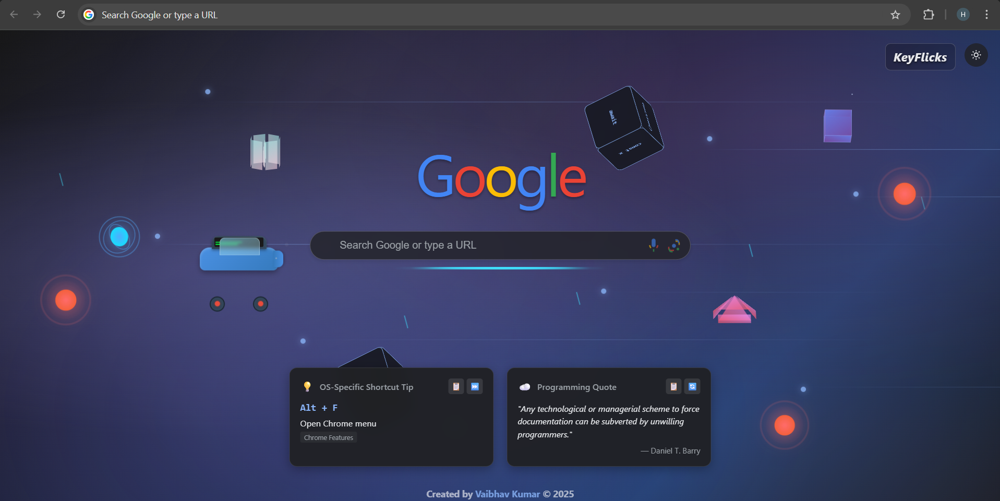
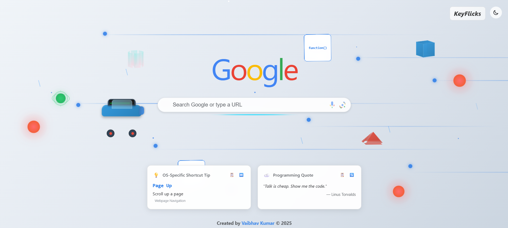

# KeyFlicks Chrome Extension

> Transform your new tab experience with keyboard shortcuts, programming quotes, and Google search

## 🚀 Quick Install

1. **[Download Extension](https://github.com/vaibhav01-git/KeyFlicks/archive/refs/heads/main.zip)** (ZIP file)
2. Extract to folder
3. Chrome → `chrome://extensions/` → Enable "Developer mode"
4. Click "Load unpacked" → Select folder
5. Open new tab → KeyFlicks loads! 🎉

## ✨ Features

- 🔍 **Google Search Integration** - Familiar interface with I'm Feeling Lucky
- ⌨️ **Smart Keyboard Shortcuts** - OS-specific shortcuts (Windows/Mac/Linux)
- 💡 **Programming Quotes** - Fresh inspiration from coding APIs
- 🎨 **Modern Glassmorphic Design** - Beautiful animations and effects
- 🌙 **Theme System** - Auto/Light/Dark modes
- 📱 **Responsive** - Works on all screen sizes

## 🖼️ Screenshots

### Dark Theme

### Light Theme  

## 🛠️ Tech Stack

- Vanilla JavaScript (ES6+)
- Chrome Extension APIs
- CSS3 Animations
- Programming Quotes API

## 📝 License

MIT © [Vaibhav Kumar](https://github.com/vaibhav01-git)

---

**[🌐 Live Demo](https://vaibhav01-git.github.io/KeyFlicks/) | [📥 Download](https://github.com/vaibhav01-git/KeyFlicks/archive/refs/heads/main.zip) | [🐛 Issues](https://github.com/vaibhav01-git/KeyFlicks/issues)**