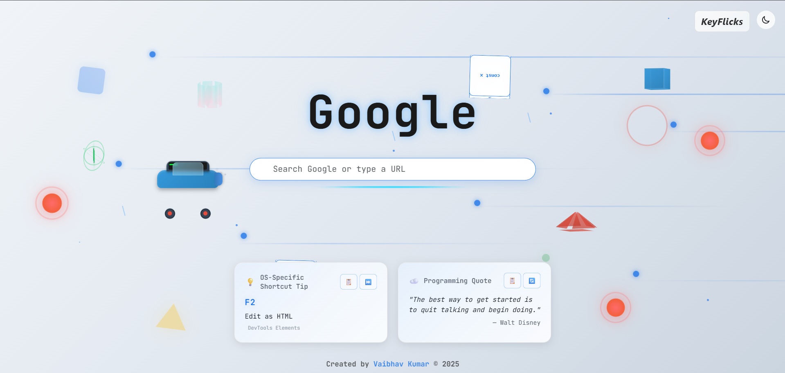

# KeyFlicks Chrome Extension

> Transform your new tab experience with keyboard shortcuts, programming quotes, and Google search

[](https://github.com/vaibhav01-git/KeyFlicks)
[](LICENSE)
[](https://vaibhav01-git.github.io/KeyFlicks/)

## 🚀 Quick Install

1. **[Download Extension](https://github.com/vaibhav01-git/KeyFlicks/archive/refs/heads/main.zip)** (ZIP file)
2. Extract to folder
3. Chrome → `chrome://extensions/` → Enable "Developer mode"
4. Click "Load unpacked" → Select folder
5. Open new tab → KeyFlicks loads! 🎉

## ✨ Features

- 🔍 **Enhanced Google Search** - Glassmorphic interface with neon glows and smooth animations
- ⌨️ **Smart Keyboard Shortcuts** - OS-specific shortcuts with terminal-style presentation
- 💡 **Programming Quotes** - Fresh inspiration with holographic effects and smooth transitions
- 🎨 **Cyberpunk Hacker Theme** - Matrix-style digital rain, floating 3D objects, scan lines
- ⚡ **Interactive Effects** - Glitch effects, holographic elements, neon button animations
- 🌙 **Dual Theme System** - Dark hacker theme and clean light theme with glassmorphism
- 📱 **Responsive & Optimized** - Performance considerations for mobile and reduced motion
- 🎯 **Developer-Focused** - Built by developers, for developers with authentic hacker aesthetics

## 🖼️ Screenshots

### Enhanced Hacker Dark Theme

*Features: Matrix digital rain, floating 3D objects, glassmorphic cards, neon glows*

### Clean Light Theme  

*Features: Clean design with subtle glassmorphism and enhanced visual feedback*

### 🎮 Interactive Demo
[**View Enhanced Hacker Theme Demo**](enhanced-hacker-demo.html) - Experience all the cyberpunk effects!

## 🛠️ Tech Stack

- **Frontend**: Vanilla JavaScript (ES6+), Advanced CSS3 with Glassmorphism
- **Fonts**: JetBrains Mono for authentic developer experience
- **Effects**: Matrix digital rain, 3D floating objects, glitch animations
- **APIs**: Chrome Extension APIs, Programming Quotes API
- **Styling**: CSS Grid, Flexbox, CSS Custom Properties, Backdrop Filters
- **Performance**: Optimized animations, reduced motion support, mobile-first design

## 📁 Project Structure

```
KeyFlicks/
├── README.md                    # Main documentation
├── manifest.json               # Extension manifest
├── newtab.html                 # New tab page
├── index.html                  # Landing page
├── background.js               # Background script
├── js/                         # JavaScript files
│   └── script.js               # Main application logic
├── styles/                     # CSS stylesheets
│   ├── hacker-theme.css        # Base hacker theme
│   ├── enhanced-hacker-theme.css # Enhanced effects
│   ├── glassmorphic.css        # Glassmorphism styles
│   └── animations.css          # Animation definitions
├── data/                       # Data files
│   └── shortcuts.json          # Keyboard shortcuts data
├── icons/                      # Extension icons
│   ├── icon16.png
│   ├── icon48.png
│   └── icon128.png
├── enhanced-hacker-demo.html   # Interactive demo
├── screenshots/                # Project screenshots
└── assets/                     # Additional assets
```

## 📝 License

MIT © [Vaibhav Kumar](https://github.com/vaibhav01-git)

## 🚀 What's New in Enhanced Version

- ✨ **Matrix Digital Rain**: Authentic falling character effect
- 🎨 **Cyberpunk Aesthetics**: Full hacker-inspired visual overhaul
- ⚡ **Interactive Glitch Effects**: Periodic logo and text glitching
- 🌈 **Holographic Elements**: Shimmer effects on card hover
- 🔥 **Neon Button Animations**: Glowing borders with sweep effects
- 📺 **Scan Lines**: Retro CRT monitor styling
- 🎯 **Enhanced 3D Objects**: More detailed floating elements
- 🔧 **Developer Font**: JetBrains Mono for authentic coding feel
- 📱 **Better Mobile Support**: Optimized performance for all devices
- 🎛️ **Advanced Glassmorphism**: Multi-layer backdrop effects

---

**[🌐 Live Demo](https://vaibhav01-git.github.io/KeyFlicks/) | [🎮 Hacker Demo](enhanced-hacker-demo.html) | [📥 Download](https://github.com/vaibhav01-git/KeyFlicks/archive/refs/heads/main.zip) | [🐛 Issues](https://github.com/vaibhav01-git/KeyFlicks/issues)**

## 🎨 Enhanced Hacker Theme Features

### 🌧️ Matrix Digital Rain
- Authentic Matrix-style falling characters
- Japanese katakana and binary digits
- Smooth animations with performance optimization
- Responsive column generation

### ⚡ Interactive Effects
- **Glitch Effects**: Periodic logo glitching with RGB separation
- **Holographic Elements**: Shimmer effects on hover
- **Neon Buttons**: Glowing borders with sweep animations
- **Scan Lines**: Retro CRT monitor effect

### 🎯 3D Floating Objects
- Rotating cubes with gradient fills
- Pulsing rings with glow effects
- Animated triangles and geometric shapes
- Smooth floating animations

### 🔧 Developer Experience
- **JetBrains Mono Font**: Professional coding font
- **Terminal Styling**: Authentic command-line aesthetics
- **Code Snippets**: Floating code elements
- **Cyberpunk Grid**: Subtle background grid pattern

### 🎛️ Advanced Glassmorphism
- Multi-layer backdrop filters
- Gradient overlays and borders
- Enhanced depth with shadows
- Smooth hover transitions

### 📱 Performance & Accessibility
- Reduced motion support for accessibility
- Mobile-optimized with selective effect hiding
- Efficient animation loops
- Theme-aware color schemes